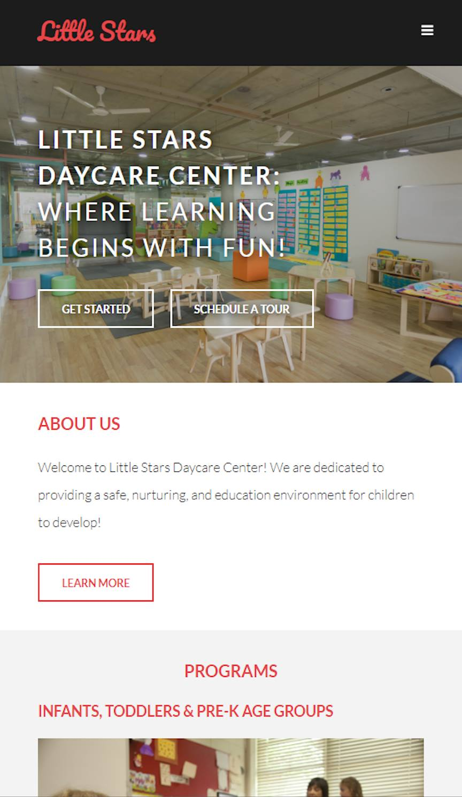

# Little Stars Daycare Center : <a target="_blank" href="https://jordan-russo.github.io/little-stars-daycare-center/">Visit Here</a>

## Tech used: 

This was a quick-paced project that was focused on making a client website that had an intuitive UI and a streamlined UX.

## Optimizations

When I improve this project, I would use JS to make the eventListener on all buttons account for the height of the fixed navbar so that magic numbers wouldn't be needed in any circumstances.

## Lessons Learned:

Learned that text-shadow is one of many tools that can be used to make text more visible from a background, and that sometimes using more than one shadow is neccesary for the text to pop out. In addition, other properties such as -webkit-text-stroke (inherited tools from svgs) that can be used in all major browsers is another design choice that could be used without changing the background surrounding the text to outline it and make it look better (more useful with large font sizes).
